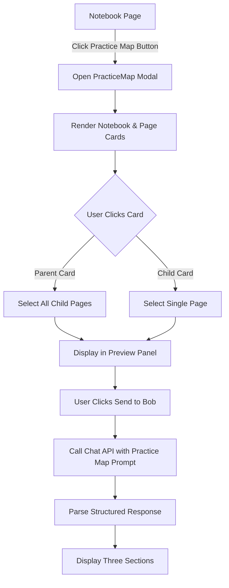
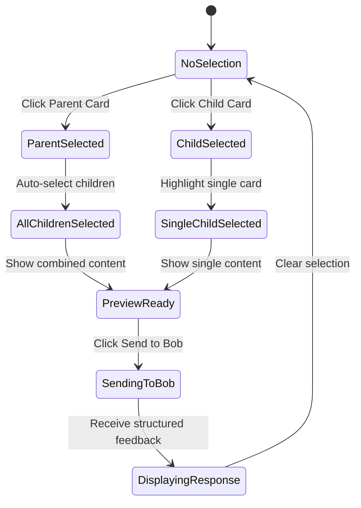

# Practice Map Feature - Implementation Plan

## Overview
The Practice Map is a visual interface that displays notebooks (parent categories) and their pages (child notes) as interactive cards. Users can select content and send it to Bob for structured coaching feedback.

## Architecture

### Component Structure

```
PracticeMap (Modal Component)
├── PracticeMapHeader
│   └── Close button
├── MapCanvas (Visual Card Layout)
│   ├── NotebookCard (Parent) × N
│   │   └── Visual indicator of child count
│   └── PageCard (Child) × N
│       └── Preview snippet
├── PreviewPanel
│   ├── SelectedContentDisplay
│   │   ├── Markdown renderer
│   │   └── Content metadata
│   └── SendToBobButton
└── BobResponseArea
    ├── SmallWinSection
    ├── PatternObservationSection
    └── NextPracticeFocusSection
```

### Data Flow



### Selection Logic Flow



## Component Specifications

### 1. PracticeMap Component (`src/components/PracticeMap.jsx`)

**Props:**
- `isOpen`: boolean - Controls modal visibility
- `onClose`: function - Close handler
- `notebooks`: array - Notebook data from parent
- `isGuest`: boolean - Guest mode flag

**State:**
- `selectedItems`: array - Currently selected notebook/page IDs
- `selectionType`: string - 'parent' | 'child' | null
- `previewContent`: object - Content to display in preview
- `bobResponse`: object - Structured response from Bob
- `isLoadingResponse`: boolean - Loading state

**Key Methods:**
```javascript
handleParentClick(notebookId)
  - Select notebook
  - Auto-select all child pages
  - Combine content for preview

handleChildClick(pageId)
  - Select single page
  - Load page content for preview

sendToBob()
  - Format selected content
  - Call chat API with special prompt
  - Parse structured response

clearSelection()
  - Reset all selection state
```

### 2. Visual Card Design

**Parent Card (Notebook):**
```css
.practice-map-parent-card {
  - Larger size (200px × 150px)
  - Gradient background
  - Bold title
  - Child count badge
  - Hover effect: scale + glow
  - Selected state: border highlight
}
```

**Child Card (Page):**
```css
.practice-map-child-card {
  - Smaller size (160px × 120px)
  - Subtle background
  - Page title
  - Content preview (2 lines)
  - Hover effect: lift shadow
  - Selected state: checkmark overlay
}
```

**Layout Pattern:**
```
┌─────────────────────────────────────────────┐
│  [Parent 1]  [Child 1.1] [Child 1.2]       │
│              [Child 1.3]                    │
│                                             │
│  [Parent 2]  [Child 2.1] [Child 2.2]       │
│              [Child 2.3] [Child 2.4]       │
└─────────────────────────────────────────────┘
```

### 3. Preview Panel Design

**Layout:**
```
┌─────────────────────────────────┐
│ Selected Content                │
│ ─────────────────────────────── │
│                                 │
│ [Markdown Rendered Content]     │
│                                 │
│ ─────────────────────────────── │
│         [Send to Bob 🤖]        │
└─────────────────────────────────┘
```

**Features:**
- Scrollable content area
- Markdown rendering with syntax highlighting
- Metadata display (page count, word count)
- Prominent Send to Bob button

### 4. Bob's Response Structure

**System Prompt Addition:**
```
When analyzing practice notes from the Practice Map, structure your response 
in exactly three sections:

1. 🎉 Small Win: Acknowledge one specific positive element
2. 🔍 Pattern/Observation: Identify one meaningful pattern or insight
3. 🎯 Next Practice Focus: Suggest one specific, actionable next step

Format each section with the emoji and heading, followed by 2-3 sentences.
```

**Response Parsing:**
```javascript
parseStructuredResponse(text) {
  const sections = {
    smallWin: extractSection(text, '🎉 Small Win'),
    pattern: extractSection(text, '🔍 Pattern/Observation'),
    nextFocus: extractSection(text, '🎯 Next Practice Focus')
  };
  return sections;
}
```

**Display Format:**
```
┌─────────────────────────────────┐
│ 🎉 Small Win                    │
│ [Content here]                  │
│                                 │
│ 🔍 Pattern/Observation          │
│ [Content here]                  │
│                                 │
│ 🎯 Next Practice Focus          │
│ [Content here]                  │
└─────────────────────────────────┘
```

## Integration Points

### 1. Notebook Page Integration

**Add trigger button in [`Notebook.jsx`](src/pages/Notebook.jsx):**
```jsx
<button className="practice-map-trigger" onClick={() => setIsPracticeMapOpen(true)}>
  <Map size={18} />
  Practice Map
</button>
```

**Location:** In the notebook sidebar header, next to the search bar

### 2. Chat API Integration

**Modify [`server/index.js`](server/index.js):**
```javascript
// Add practice map mode detection
if (req.body.practiceMapMode) {
  systemPrompt = PRACTICE_MAP_SYSTEM_PROMPT;
}
```

### 3. State Management

**Add to [`App.jsx`](src/App.jsx):**
```javascript
const [isPracticeMapOpen, setIsPracticeMapOpen] = useState(false);
```

Pass to Notebook component as prop.

## Styling Guidelines

### Color Scheme
- **Parent Cards:** Gradient from primary to secondary brand colors
- **Child Cards:** Subtle glassmorphic effect with backdrop blur
- **Selected State:** Accent color border (--accent-color)
- **Preview Panel:** Dark background with high contrast text

### Animations
- Card hover: `transform: scale(1.05)` with 200ms ease
- Selection: Fade-in checkmark overlay
- Modal entrance: Slide up with fade-in
- Bob response: Staggered section reveal

### Responsive Design
- Desktop: 3-column grid for cards
- Tablet: 2-column grid
- Mobile: Single column, stack preview below cards

## Guest Mode Handling

**Restrictions:**
- Can view Practice Map
- Can select and preview content
- **Cannot** send to Bob (show upgrade prompt)
- Display: "Sign up to get coaching feedback on your practice notes"

**Implementation:**
```javascript
if (isGuest) {
  return (
    <button disabled className="send-to-bob-disabled">
      <Lock size={16} />
      Sign up to send to Bob
    </button>
  );
}
```

## File Structure

```
src/
├── components/
│   ├── PracticeMap.jsx          (Main modal component)
│   ├── PracticeMap.css          (Styling)
│   ├── NotebookCard.jsx         (Parent card component)
│   ├── PageCard.jsx             (Child card component)
│   └── BobResponsePanel.jsx    (Structured response display)
├── pages/
│   └── Notebook.jsx             (Add trigger button)
└── App.jsx                      (State management)

server/
└── index.js                     (Add practice map prompt)
```

## Implementation Phases

### Phase 1: Core Structure
1. Create PracticeMap modal component
2. Implement basic card rendering
3. Add open/close functionality

### Phase 2: Selection Logic
4. Implement parent card click → select all children
5. Implement child card click → select single
6. Build preview panel with content display

### Phase 3: Bob Integration
7. Add "Send to Bob" functionality
8. Implement special system prompt
9. Parse and display structured response

### Phase 4: Polish
10. Add animations and transitions
11. Implement responsive design
12. Handle guest mode restrictions
13. Add error handling and loading states

## Testing Checklist

- [ ] Modal opens/closes correctly
- [ ] Parent card selection selects all children
- [ ] Child card selection works independently
- [ ] Preview displays correct content
- [ ] Send to Bob triggers API call
- [ ] Response is properly structured
- [ ] Guest mode shows appropriate restrictions
- [ ] Responsive design works on all screen sizes
- [ ] Animations are smooth
- [ ] Error states are handled gracefully

## Success Metrics

**User Experience:**
- Visual clarity: Cards are easily distinguishable
- Interaction feedback: Clear selection states
- Response quality: Bob provides actionable insights

**Technical:**
- Modal loads in < 200ms
- Card rendering handles 50+ pages smoothly
- API response time < 3 seconds
- No layout shifts during interactions

## Future Enhancements

1. **Drag-and-drop reordering** of cards
2. **Filtering** by date, tags, or keywords
3. **Bulk operations** (archive, export multiple notes)
4. **Visual connections** showing related notes
5. **Progress tracking** visualization
6. **Export Practice Map** as image/PDF